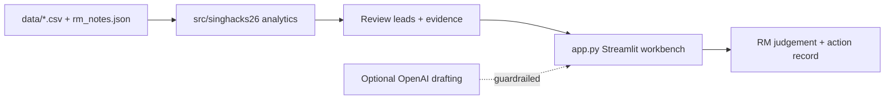

# RM Intelligence Workbench

An AI-assisted workbench that turns private-banking portfolio data into
**review-ready, evidence-traced client insights**. Built for the SingHacks 2026
Julius Baer Wealth Intelligence challenge, which asks teams to move from "what
does my client's portfolio look like?" to "what should I know, and what should
I do next?"

```text
1. **Source** - load the synthetic book: 20 clients, 24 portfolios, 1,015 positions across five dated snapshots.
2. **Analyse** - run deterministic checks for mandate fit, risk alignment, liquidity, collateral and event exposure.
3. **Explain** - attach evidence to every review lead, resolved to a CSV line or note section.
4. **Prepare** - order the RM's attention and produce action briefs and 60-second call briefs.
5. **Decide** - the RM records judgement and follow-through locally; the app never trades or contacts clients.
```

The challenge specification is in [docs/challenge.md](docs/challenge.md).
The challenge is from [Singhacks-2026/juliusbaer](https://github.com/Singhacks-2026/juliusbaer)

---

## Architecture



- **Data layer** - synthetic client, portfolio, holdings, mandate, event and RM-note files. `event_log.csv` is the controlled source of truth for 2026.
- **Analytics layer** - `src/singhacks26/` computes allocation, mandate, liquidity, collateral and event-exposure checks without a model.
- **Evidence layer** - every review lead carries evidence IDs that resolve to physical CSV lines or note sections.
- **UI layer** - a Streamlit app with pages for the book, alignment, command center, casebook, deep dive, notes and action record.
- **AI layer (optional)** - guardrailed OpenAI drafting from a censored fact packet. It cannot access files, calculate numbers or approve anything.

---

## Repository structure

```text
.
├── app.py             # Streamlit entry point
├── src/singhacks26/   # analytics, AI guardrails, evidence resolution
├── data/              # synthetic dataset (CSV files + RM notes)
├── obsidian_vault/    # censored per-client notes and local caches
├── scripts/           # data-prep and market-api utilities
├── starter/           # challenge-provided data orientation script
├── tests/             # pytest suite
└── docs/              # challenge spec, architecture, data dictionary
```

---

## Getting started

### Prerequisites

- Python 3.11+
- [uv](https://docs.astral.sh/uv/) for dependencies and environments
- API keys are optional: `OPENAI_API_KEY` for alignment reports and AI drafts, `MARKETAUX_API_KEY` for live news

### 1. Install dependencies

```powershell
uv sync
```

### 2. Run the workbench

```powershell
uv run streamlit run app.py
```

Then open the URL Streamlit prints.

> The app runs without API keys. Live news and AI drafting simply stay disabled.

### 3. Run the tests

```powershell
uv run pytest
```

---

## How the workbench works

1. **Load and hash** - CSV files load once and a source hash invalidates cached analysis when data changes.
2. **Surface review leads** - per-client checks flag mandate drift, risk mismatch, liquidity gaps, collateral stress and event exposure.
3. **Trace evidence** - each lead carries evidence IDs that resolve to CSV line numbers for RM verification.
4. **Prepare the RM** - leads become ordered action briefs and a 60-second call brief with questions to ask.
5. **Record judgement** - decisions, tasks and conversation reflections persist locally with an audit trail.

---

## Scope and honesty note

Built for a hackathon within a limited timebox.

What is implemented:

- **Deterministic analytics** - mandate, allocation, liquidity, collateral and event-exposure checks.
- **Evidence tracing** - review leads resolve to CSV lines and note sections.
- **Guardrailed AI drafting** - censored fact packets with numeric and language guardrails.
- **Local workflow state** - tasks, decisions and reflections with an audit trail.

Not implemented:

- Bank SSO and immutable audit storage.
- Real client data or a live banking connection.
- Autonomous trading, client contact or tax conclusions.

The dataset is fully synthetic. No real client data is used.

> LLM Disclosure: Most of this project, including this README, were generated with the help of a large language model, due to the short time constraint of the hackathon

---

## Tech stack

| Area           | Tech                                      |
| -------------- | ----------------------------------------- |
| Language       | Python 3.11+                              |
| UI             | Streamlit                                 |
| Data           | pandas                                    |
| AI             | OpenAI Responses API (structured outputs) |
| Packaging      | uv, hatchling                             |
| Testing / lint | pytest, ruff                              |
| API            | MarketAux                                 |
